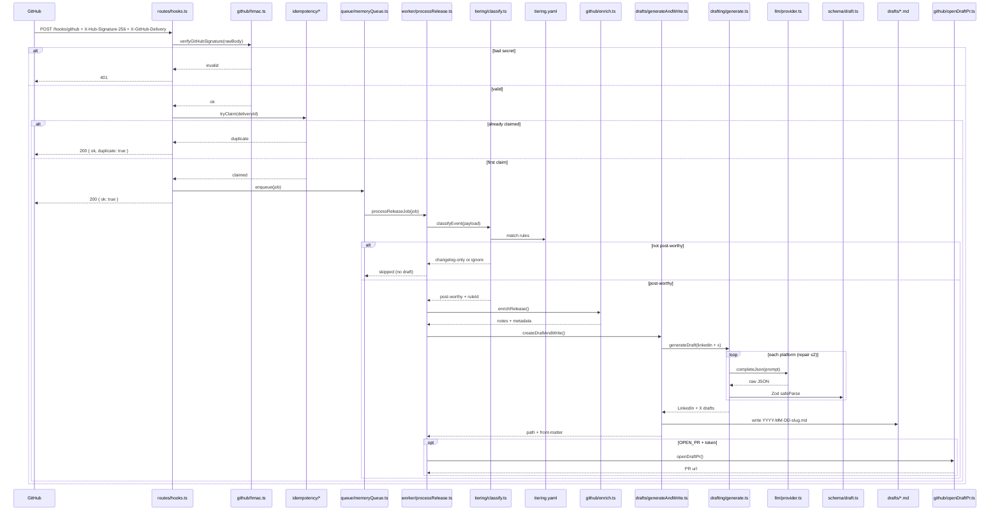
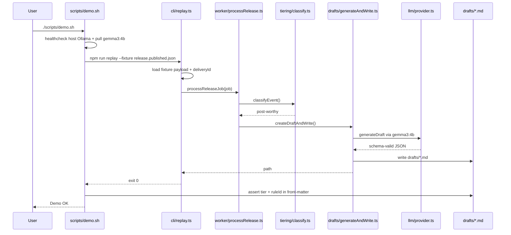

# ai-github-release-post-drafter

[](https://github.com/he-is-talha/ai-inbox-router)

Turns a GitHub **release** webhook into a schema-locked LinkedIn + X draft markdown file (and optionally an approval PR). Nothing is auto-published.


> Demo: `docs/demo.gif` / `docs/demo.mp4` — hook → webhook + HMAC + claim → post-worthy tier → schema-locked draft → approval PR → duplicate drop.

## What it does

1. Verifies `X-Hub-Signature-256` (HMAC).
2. Claims `X-GitHub-Delivery` once (memory or Redis) so retries do not double-write.
3. Classifies the event with `tiering.yaml` → `post-worthy` | `changelog-only` | `ignore`.
4. For post-worthy releases, asks local Ollama (`gemma3:4b`) for JSON matching a Zod draft schema (with repair retries).
5. Writes `drafts/YYYY-MM-DD-slug.md` (LinkedIn + X sections + front-matter `tier` / `ruleId`).
6. Optionally opens a draft PR when `OPEN_PR=true` and a token is set.

**Non-goals:** auto-posting to LinkedIn/X; cloud LLM as default; LLM-as-judge for tiering.

## Stack

| Piece | Choice |
|-------|--------|
| Runtime | Node **24+**, TypeScript, ESM |
| HTTP | Fastify `POST /hooks/github` |
| Idempotency | In-memory (default) or Redis |
| LLM | Ollama **`gemma3:4b`** (host install by default) |
| Config | `tiering.yaml`, `style-guide.md`, Zod draft schema |
| GitHub | Octokit enrich + optional draft PR |

## Architecture

```
GitHub Release webhook
      |
      v
[ HMAC verify ]--fail--> 401
      |
      v
[ claim X-GitHub-Delivery ]--dup--> 200 { duplicate: true }
      |
      v
200 { ok: true }  (ack before work)
      |
      v
[ classifyEvent (tiering.yaml) ]--changelog-only/ignore--> skip (no draft)
      | post-worthy
      v
[ enrich release ] --> [ Ollama gemma3:4b + Zod repair ≤2 ]
      |
      v
drafts/YYYY-MM-DD-slug.md  (+ optional approval PR)
```

### Flow A — `POST /hooks/github` (live webhook)

Cross-file path for a published release delivery:



### Flow B — `npm run replay` / `./scripts/demo.sh` (fixture, no GitHub)

Same worker path as Flow A, fed from a committed webhook fixture:



## Quick start (local)

```bash
cp .env.example .env
ollama pull gemma3:4b          # or: npm run pull-model
npm install
npm test
npm run typecheck
npm run dev
```

Server: `http://0.0.0.0:3000` · Webhook: `POST /hooks/github`

### Fixture demo (no GitHub)

```bash
./scripts/pull-model.sh
./scripts/demo.sh
# or: npm run replay -- --fixture fixtures/github/release.published.json
```

Success = a new `drafts/*.md` with front-matter `tier` and `ruleId`.

### Docker (Redis + app; host Ollama)

Default compose **does not** start Ollama.

```bash
cp .env.example .env
docker compose up -d --build
./scripts/demo.sh
```

Optional in-compose Ollama:

```bash
docker compose --profile with-ollama up -d
```

## Env

| Variable | Purpose |
|----------|---------|
| `GITHUB_WEBHOOK_SECRET` | HMAC secret (required) |
| `OLLAMA_HOST` / `OLLAMA_MODEL` | Default model `gemma3:4b` |
| `IDEMPOTENCY_BACKEND` | `memory` (default) or `redis` |
| `REDIS_URL` | Needed if backend is `redis` |
| `OPEN_PR` | `true` to open an approval PR (default `false`) |
| `GITHUB_TOKEN` / `GITHUB_REPO` | PR open (contents + pull-requests write) |

## GitHub webhook

1. Expose port 3000 (ngrok/smee).
2. Payload URL: `https://<tunnel>/hooks/github`
3. Secret = `GITHUB_WEBHOOK_SECRET`; content type JSON.
4. Subscribe to **Release** events.

**Push / tag push is not enough** — publish a GitHub **Release**.

## Measured numbers (fixtures + Chunk 15 e2e)

From committed fixtures + `tests/e2e/idempotency.replay.test.ts` (fake LLM, deterministic):

| Metric | Value | How |
|--------|-------|-----|
| `duplicate_drops` | **1** | Same `X-GitHub-Delivery` posted twice → second `{ duplicate: true }`, still one draft file |
| `tier_counts` (fixture set) | **1** post-worthy / **1** changelog-only | `release.published.json` vs `release.prerelease.json` |
| `draft_success` (happy path) | **1** | One published delivery → one markdown file |
| `draft_failure` (happy path) | **0** | Fake LLM always returns schema-valid JSON |
| Draft files after duplicate | **1** | Idempotency claim before enqueue |
| Draft files for prerelease | **0** | Skipped as `changelog-only` |

Re-check anytime:

```bash
npm test -- tests/e2e/idempotency.replay.test.ts
```

## Known failure modes

| Symptom | Cause | What happens |
|---------|--------|----------------|
| HTTP **401** | Bad / missing webhook secret | HMAC reject; GitHub may retry |
| HTTP **200** `{ duplicate: true }` | Same `X-GitHub-Delivery` again | No second draft; `duplicateDrops++` |
| No draft / worker error | Ollama down or repair exhausted | `draftFailure++`; no PR |
| Local draft only | `OPEN_PR` without token/repo | File written; PR step skipped |
| Event ignored / skipped | Push, prerelease, or tier rules | No draft (by design) |

## Scripts

| Script | Command |
|--------|---------|
| Dev server | `npm run dev` |
| Tests | `npm test` |
| Typecheck | `npm run typecheck` |
| Replay fixture | `npm run replay -- --fixture …` |
| Demo | `npm run demo` / `./scripts/demo.sh` |
| Pull model | `npm run pull-model` |

## Series

**Boring AI — Project 3/15**

- Previous: [ai-inbox-router](https://github.com/he-is-talha/ai-inbox-router) (Project 2/15)
- Next: [ai-notes-to-tasks-agent](https://github.com/he-is-talha/ai-notes-to-tasks-agent) (Project 4/15)
